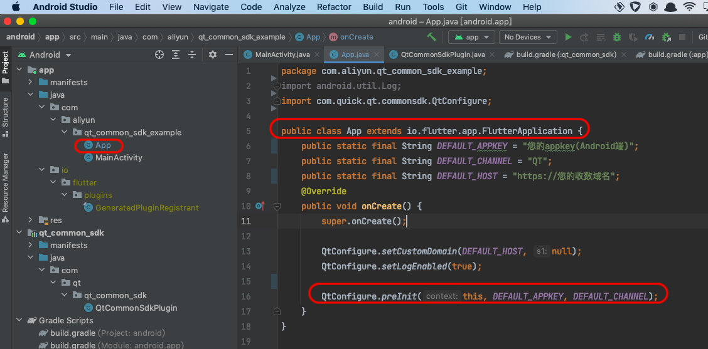
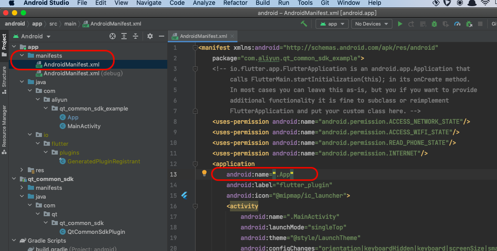

# Quick Tracking 统计SDK Flutter插件集成说明

> 基于老版本QT统计SDK + SPM插件封装。需配合Android 端 1.3.4版本qt-common包和qt-spm包一起使用。

--- 


## 集成Flutter插件

### 自动集成

在您的flutter工程 pubspec.yaml 中加入插件依赖

``` yaml
# 线上依赖

dependencies:
  qt_common_sdk: 1.0.0
  
```  

**导入**

``` flutter
import 'package:qt_common_sdk/qt_common_sdk.dart';

```

---

### 手动集成

*  下载本工程git库，删除工程目录下.git隐藏目录。
*  将本工程根目录下android、ios、lib三个文件夹和pubspec.yaml配置文件拷贝到您的flutter工程中。

在您的flutter工程pubspec.yaml中加入插件依赖

``` yaml
#本地依赖

qt_common_sdk::
    path: ../
    
```

**导入**

``` flutter
import 'package:qt_common_sdk/qt_common_sdk.dart';

```

---

## 插件SDK初始化

### Android端

请参考本工程中示例Android 宿主工程中App.java文件(example/android/app/src/main/java/com/aliyun/qt_common_sdk_example/App.java)，给您的flutter工程Android宿主工程增加App类，注意此类必须是 io.flutter.app.FlutterApplication 类的子类。在App类的onCreate生命周期函数内，调用原生统计SDK的预初始化方法UMConfigure.preInit，并传入appkey和渠道参数。



另外，您还需要在Android宿主工程AndroidManifest.xml清单文件中 application 配置中添加 “android:name”属性，其值为新增的 App 类。如下图：



注意，预初始化传入的appkey和渠道参数必须和后续在flutter工程的dart代码中调用的SDK正式初始化函数QTCommonSdk.initCommon 传入的第一个参数(Android appkey)和第三个参数(Android 渠道)必须严格一致。

为了满足《隐私政策》要求，开发者必须保证在应用安装后，首次冷启动场景，只能在App用户同意隐私授权之后，才能调用flutter插件的QTCommonSdk.initCommon接口真正出初始化SDK。

用户已经同意隐私授权之后的后续应用冷启动，可以在flutter首个页面初始化时直接调用QTCommonSdk.initCommon接口初始化SDK。


---

### iOS端

1.合规声明

您务必告知用户您选择SDK服务，请在《隐私政策》中增加如下参考条款：

“我们的产品集成SDK，SDK需要收集您的设备识别码（IDFA/IDFV/OPENUDID/GUID/）以提供统计分析服务，并通过地理位置校准报表数据准确性，提供基础反作弊能力。”

2.合规初始化

为保证您的App在集成统计SDK之后，能够满足工信部相关合规要求，您应确保App首次冷启动时，在用户阅读您的《隐私政策》并取得用户授权之后，才调用正式初始化函数初始化统计SDK，此时SDK才会真正采集设备信息并上报数据。反之，如果用户不同意《隐私政策》授权，则不能调用初始化函数。

```

/** 初始化所有组件产品
 @param appKey 开发者申请的appkey.
 @param channel 渠道标识，可设置nil表示"App Store".
 */
+ (void)initWithAppkey:(NSString *)appKey channel:(NSString *)channel;


```

一旦App获取到《隐私政策》的用户授权，后续的App冷启动，开发者应该保证调用到初始化函数。

---

## 插件接口说明


如下各个接口注释部分会针对接口或者参数标注 "Android特有" 或 "iOS特有"，请注意区分。
没有特别标注的接口或者参数即为Android和iOS双端通用。

``` dart
///
  /// 设置上报统计日志的主域名和备用域名。此函数必须在SDK初始化函数调用之前调用。
  ///
  /// @param primaryDomain String 主域名.
  /// @param standbyDomain String 备用域名 上传日志备用域名收数地址,参数可以为null或者空串，若此参数为空，SDK内部会自动将主域名设置为备用域名。
  ///
  ///
static void setCustomDomain(String primaryDomain, String standbyDomain)

///
  /// 初始化
  ///
  /// @param androidAppkey String 开发者申请的android appkey。android特有，Android端填写
  /// @param iosAppkey String 开发者申请的ios appkey。 ios特有，iOS端填写
  /// @param channel String 渠道标识，可设置nil表示"App Store".
  ///
  ///
static Future<dynamic> initCommon(String androidAppkey, String iosAppkey, String channel)

///
  /// 自定义app版本号，默认获取version，只可设置一次建议在所有接口之前调用
  ///
  /// @param appVersion String 自定义版本号
  /// @param appVersionCode int 对应Android应用版本号versionCode，仅Android端会使用此参数，Android特有
  ///
static void setAppVersion (String appVersion, int appVersionCode) 

///
  /// 设置是否在console输出sdk的调试日志
  ///
  /// @param bFlag bool 设置为flase(不输出log); 设置为true, 输出可供调试参考的log信息，
  /// SDK内部默认此开关关闭，App正式上线前需将日志开关关闭。
  ///
  ///
static void setLogEnabled (bool bFlag)

///
  /// 自定义事件
  ///
  /// @param event String 事件Id.
  /// @param properties Map 自定义参数.
  ///
static void onEvent(String event, Map<String,dynamic> properties)

///
  /// @param event String 事件Id.
  /// @param pageName String 页面名称.
  /// @param properties Map 自定义参数.
  ///
static void onEventWithPage(String event,String pageName, Map<String,dynamic> properties)

///
  /// 账号统计登录
  ///
  /// @param userID String user's ID
  ///
  ///
static void onProfileSignIn(String userID)

///
  /// 账号统计登录
  ///
  /// @param userID String user's ID
  /// @param provider String user's provider
  ///
static void onProfileSignInEx(String userID, String provider)

///
  /// 账号统计登出
  ///
  ///
static void onProfileSignOff ()

///
  /// 页面统计: 页面开始显示时调用
  ///
  /// @param viewName String 页面名称
  ///
  ///
static void onPageStart(String viewName)

///
  /// 页面统计：页面消失时调用
  ///
  /// @param viewName String 页面名称
  ///
  ///
static void onPageEnd(String viewName)

///
  /// 设置页面属性.
  ///
  /// @param pageName String 页面名称
  /// @param properties Map 自定义参数
  ///
static void setPageProperty(String pageName, Map<String,dynamic> properties)

///
  /// 注册全局属性
  ///
  /// @param properties Map 自定义参数
  ///
  ///
static void registerGlobalProperties(Map<String,dynamic> properties)

///
  /// 删除一个全局属性
  ///
  /// @param propertyName String 自定义参数key
  ///
  ///
static void unregisterGlobalProperty(String propertyName)

///
  /// 获取全局属性
  ///
  ///
static Future<String>? get getGlobalProperties async

///
  /// 获取一个全局属性值
  ///
  ///
static Future<dynamic>? getGlobalProperty(String propertyName) async

///
  /// 清除全局属性
  ///
static void clearGlobalProperties() 


```


**注意** : 需要先调用 QTConfigure.init 来初始化插件（Appkey可在统计后台 “管理->应用管理->应用列表” 页面查看，或在 “我的产品”选择某应用->设置->应用信息 查看Appkey），才能保证其他功能正常工作。
